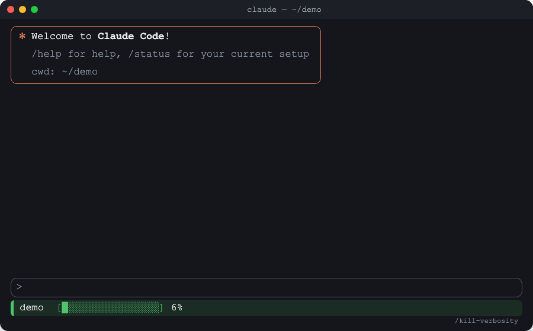

# kill-verbosity

A Claude Code skill that makes a Markdown document shorter, then proves nothing
was lost: no number, path, identifier or rule.



## Install

```bash
git clone https://github.com/marekasf/kill-verbosity ~/.claude/skills/kill-verbosity
```

Already have a `kill-verbosity` skill there? Move it aside first.

Needs Python 3.9+. Nothing else to install.

## Use

In Claude Code:

```
/kill-verbosity docs/guide.md
```

Claude shortens the file into `docs/guide.kv.md`, shows you what changed and
what it checked, and asks whether to keep it. Your original is never
overwritten until you say yes, and even then a backup copy is kept.

You can also just ask: *"kill the verbosity in docs/guide.md"*.

## More

- [User guide](docs/user-guide.md): commands, options, other agent CLIs
- [How it works](docs/how-it-works.md)
- [Known issues](docs/known-issues.md)
- [kill-verbosity vs ponytail vs the Concise output style](docs/compared.md)
- Claude Code docs: [skills](https://code.claude.com/docs/en/skills)

## License

See [LICENSE](LICENSE).
